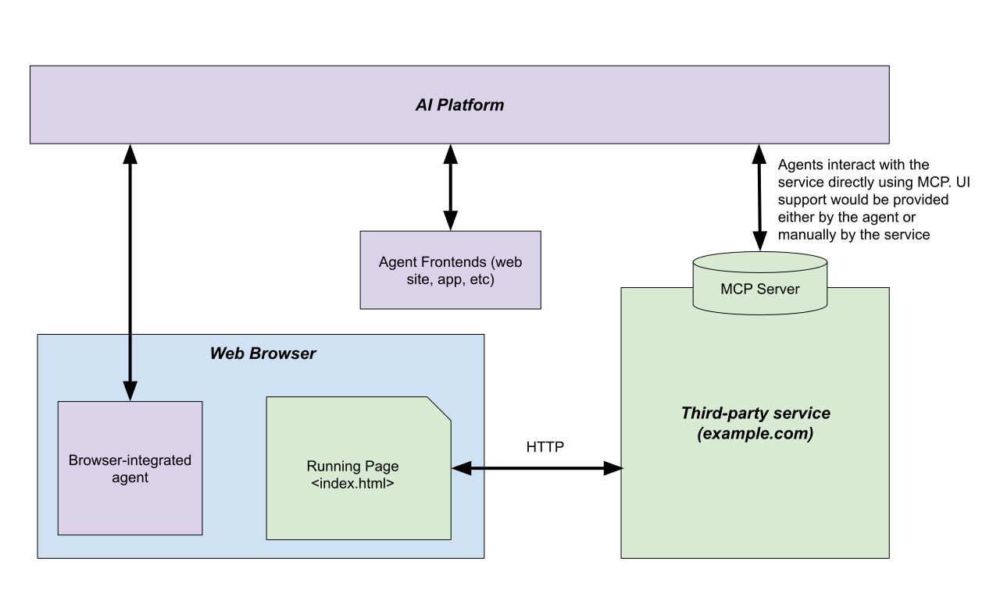

# Explainer: Script Tools API

## tl;dr

Script tools is a proposal for a new web API allowing web pages to expose their JavaScript as tools to a browser-use
AI agent. When an agent navigates to a page using this API, the page's tools become available to help it achieve its
task more directly than by simulating user input over the human interface. A simplifying analogy would be: an MCP server
implemented by a page's client code.

For the technical details of the proposal, code examples, API shape, etc. see [proposal.md](proposal.md).

## Terminology Used

###### Agent
An autonomous assistant that can understand a user's goals and take actions on the user's behalf to achieve them. Today,
these are typically implemented by large language model (LLM) based AI platforms, interacting with users via text-based
chat interfaces.

###### Browser's Agent
An autonomous assistant as described above but provided by or through the browser. This could be an agent built directly
into the browser or hosted by it, for example, via an extension or plug-in.

###### AI Platform
Providers of agentic assistants such as OpenAI's ChatGPT, Anthropic's Claude, or Google's Gemini.

###### Backend Integration
A form of API integration between an AI platform and a third-party service in which the AI platform can talk directly to
the service's backend servers without a UI or running code in the client. For example, the AI platform communicating with
an MCP server provided by the service.

###### Actuation
An agent interacting with a web page by simulating user input such as clicking, scrolling, typing, etc.


## Background and Motivation

AI platforms such as ChatGPT, Claude, Gemini are increasingly able to interact with external services to perform
actions such as checking local weather, finding flight and hotel information, and providing driving directions.  These
functions are provided by external services that extend the AI model’s capabilities. These extensions, or “tools”, can
be used by an AI to provide domain-specific functionality that the AI cannot achieve on its own. Existing tools
integrate with each AI platform via bespoke “integrations” - each service registers itself with the chosen platform(s)
and the platform communicates with the service via an API (MCP, OpenAPI, etc). In this document, we call this style of
tool a “backend integration”; users make use of the tools/services by chatting with an AI, the AI platform communicates
with the service on the user's behalf.

Increasingly, users are asking AI models to take actions on their behalf. In the near future, a user will be able to
make a request, in natural language, such as: “Create a 7 day itinerary for a vacation to the Amalfi Coast and book the
flights and hotel stays.” The AI agent semi-autonomously fulfills the user’s request by performing the actions the user
would ordinarily have to do themselves, stopping only to ask clarifying questions or confirm consequential actions like
making a purchase.

AI platforms and third-party services can integrate in the backend via protocols like MCP. This allows the agent to
fulfil a user's request without additional UI and works well when the user has a specific, known task they'd like to
delegate. i.e. for an agent to fulfill its entire objective, end-to-end, with minimal supervision and direction from the
user. Booking a restaurant reservation or adding a task to a to-do list are examples a delegatable task.

However, there are several advantages to using the web to connect agents and services:

* **Businesses near-universally already offer their services via the web.**
    
    Script tools allow them to leverage their existing business logic and UI, providing a quick, simple, and incremental
    way to integrate with agents. They don't have to re-architect their product to fit the API shape of a given agent.
    This is especially true when the logic is already heavily client-side.


* **Enables visually rich, cooperative interplay between a user, web page, and agent with shared context.**

    Users often start with a vague goal which is refined over time. Consider a user browsing for a high-value purchase.
    The user may prefer to start their journey on a specific page, ask their agent to perform some of the more tedious
    actions ("find me some options for a dress that's appropriate for a summer wedding, preferably red or orange, short
    or no sleeves and no embelishments"), and then take back over to browse among the agent-selected options.

* **Allows authors to serve humans and agents from one source**

    The human-use web is not going away. Integrating agents into it prevents fragmentation of their service and allows
    them to keep ownership of their interface, branding and connection with their users.

LLM based assistants are increasingly finding their way into new and existing browsers [examples:
[Copilot in Edge](https://www.microsoft.com/en-us/edge/copilot?form=MA13SQ&cs=3515903432), [Dia](https://www.diabrowser.com/), [Gemini-in-Chrome](https://gemini.google/overview/gemini-in-chrome/?hl=en),
[Perplexity Comet](https://comet.perplexity.ai/)]. New automated browsing tools like OpenAI’s [Operator](https://openai.com/index/introducing-operator/) and Google
Deepmind’s [Project Mariner](https://deepmind.google/technologies/project-mariner/) are enabling AI models to
autonomously browse the web in the same way a user would. They observe a page, make a plan, and act by interacting.
These approaches are still in the early stages of development. While they’re improving quickly, the web’s user interface
is not well suited for automated use. Even as these agents improve, actuating on a web page will be slower, more
expensive, and have more failure modes. For example, a script tool would allow a site to deterministically indicate
which actions should require user confirmation as opposed to relying solely on Agent's understanding of the UI.

Script tools is a proposal for a web API that enables web pages to provide agent-specific paths in their UI. With script
tools, agent-service interaction takes place _via app-controlled UI_, providing a shared context available to app,
agent, and user. In contrast to backend integrations, script tools are available to an agent only once it has loaded a
page and they execute on the client. Page content and actuation remain available to the agent (and the user) but the
agent also has access to script tools which it can use to achieve its goal more directly.


In contrast, in a backend integration, the agent-service interaction takes place directly, without an associated UI. If
a UI is required it must be provided by the agent itself or somehow connected to an existing UI manually:

The expected flow using browser agents and Script Tools:



## Goals
* Enable AI-based agents to more directly, quickly, and accurately interact with a web page
* Enable agents to be more helpful when using a web browser
* Enable cooperative user-agentic journeys with shared context

## Non-Goals
* Replace / compete with backend integrations
* Replace human interfaces and human users
* Enable / influence discoverability of sites to agents

## Use Cases

The use cases for script tools are ones in which the user is collaborating with the agent, rather than completely
delegating their goal to it. They can also be helpful where interfaces are highly specific or complicated.

### Example - Creative

_Jen wants to create an invitation to her upcoming yard sale so she uses her browser to navigate to
`http://easely.example`, her favorite graphic design platform. However, she's rather new to it and sometimes struggles
to find all the functionality needed for her task in the app's extensive menus. She creates a "yard sale flyer" design
and opens up a "templates" panel to look for a premade design she likes. There's so many templates and she's not sure
which to choose from so she asks her browser agent for help._

**Jen**: Show me templates that are spring themed and that prominently feature the date and time. They should be on a
white background so I don't have to print in color.

_The current document has registered a script tool that the agent notices may be relevant to this query:_

```
/**
 * Filters the list of templates based on a description.
 *
 * description - A visual description of the types of templates to show, in natural language (English).
 */
 filterTemplates(description)
```

_The agent invokes the tool: `filterTemplate("sprint themed, date and time displayed prominently, white background")`.
The UI updates to show a filtered list matching this description._

**Agent**: Ok, the remaining templates should now match your description.

_Jen picks a template and gets to work._

_The agent notices a new tool was registered when the design was loaded:_

```
/**
 * Makes changes to the current design based on instructions. Possible actions include modifications to text
 * and font; insertion, deletion, transformation of images; placement and scale of elements. The instructions
 * should be limited a single task. Here are some examples:

 * editDesign("Change the title's font color to red");
 * editDesign("Rotate each picture in the background a bit to give the design a less symmetrical feel");
 * editDesign("Add a text field at the bottom of the design that reads 'example text'");
 *
 * instructions - A description of how the design should be changed, in natural language (English).
 */
 editDesign(instructions)
```

_With all the context of Jen's prompts, page state, and this editDesign tool, the agent is able to make helpful
suggestions on next steps:_

**Agent**: Would you like me to make the time/date font larger?

**Jen**: Sure. Could you also swap out the clipart for something more yard-sale themed?

**Agent**: Sure, let me do that for you.

**Jen**: Please fill in the time and place using my home address. The time should be in my e-mail in a message from my
husband.

**Agent**: Ok, I've found it - I'll fill in the flyer with Aug 5-8, 2025 from 10am-3pm | 123 Queen Street West.

_Jen is almost happy with the current design but think the heading could be better_

**Jen**: Help me come up with a more attention grabbing headline for the call to action and title.

**Agent**: Of course! Here are some more attention-grabbing headlines for your yard sale flyer, broken down by title and
call to action:

To Create Excitement:
 * Yard Sale Extravaganza!
 * The Ultimate Clear-Out Sale
 * Mega Garage & Yard Sale

...

**Jen**: Lets use "Yard Sale Extravaganza!" as the title. Create copies of this page with each of the call to action
suggestions.

_The agent takes this action using a sequence of tool calls which might look something like:_

* `EditDesign("Change the title text to 'Yard Sale Extravaganza!'")`
* `EditDesign("Change the call-to-action text to 'The hunt is on!'")`
* `AddPage("DUPLICATE")`
* `EditDesign("Change the call-to-action text to 'Ready, set, shop!'")`
* `AddPage("DUPLICATE")`
* `EditDesign("Change the call-to-action text to 'Come for the bargains, stay for the cookies'")`
  
_Jen now has 3 versions of the same yard sale flyer. Easely implements these script tools using AI-based techinques on
their backend to allow a natural language interface. Additionally, the UI presents these changes to Jen as an easily
reversible batch of "uncommitted" changes, allowing her to easily review the agent's actions and make changes or undo as
necessary. While the site could also implement a chat interface to expose this functionality with their own agent, the
browser's agent provides a seamless journey by using tools across multiple sites/services. For example, pulling up 
information from the user's email service._

**Agent**: Done! I've created three variations of the original design, each with a unique call to action. 

_Jen is now happy with these flyers. Normally she'd print to PDF and then take the file to a print shop. However, Easely
has a new print service that Jen doesn't know about and doesn't notice in the UI. However, the agent knows the page has
an `orderPrints` tool:

```
/**
 * Orders the current design for printing and shiping to the user.
 *
 * copies - A number between 0 and 1000 indicating how many copies of the design to print. Required.
 * page_size - The paper type to use. Available options are [Legal, Letter, A4, A5]. Default is "Letter".
 * page_finish - What kind of paper finish to use. Available options are [Regular, Glosys Photo, Matte Photo].
 *               Default is "Regular"
 */
orderPrints(copies, page_size, page_finish);
```

_The agent understands the user's intent and so surfaces a small chip in it's UI:_

**Agent**: `<Done? Click to Order Prints>`

_Jen is delighted she saved a trip to the store and clicks the button_.

**Agent**: How many copies would you like? I'll request 8.5x11 sized regular paper but there are other options available.

**Jen**: Please print 10 copies.

**Agent**: Done! The order is ready for your review.

_The site navigates to the checkout page where Jen can review the order and click the checkout button to confirm._


### Example - Shopping

Shopping often includes exploration, browsing, and reviewing. The agent can help and remove the tedious parts but the
user wants to be involved.

_Maya has a few favorite clothing vendors but doesn't get formal clothes very often so she opens her AI assistant_

**Maya**: Suggest a few formal or semi-formal dress places where I can shop for my friend’s wedding. Please make sure
they are ecofriendly and not too expensive.

**Agent**: Sure, here's a few suggestions

1. Elara - uses innovative recycled and plant-based fabrics to minimize waste for a modern, chic wardrobe that allows
  you to embrace the latest trends, responsibly. Price Range: Dresses typically \$90 - \$220 CAD

2. Linden Harbour - creates wonderfully crafted womenswear designed to last a lifetime. Carries everything from classic
shirt dresses to elegant knitwear, meticulously made from the finest organic cotton, linen, and responsibly sourced
wool. Price Range: Dresses typically \$250 - \$550 CAD

3. Wildebloom - Flowing dresses brought to life through artisanal collaborations, using natural plant dyes and panels of
  upcycled vintage textiles.  Price Range: Dresses typically \$180 - \$450 CAD

**Maya**: Lets take a look at Wildebloom.

_The agent now opens Maya's web browser, which it is integrated with. i.e. the agent can observe and control the
browser. It navigates to the dresses page on `http://wildebloom.example/shop`_

**Agent**: Ok, here are the dresses that Wildebloom carries.

_Maya is immediately overwhelmed. There are so many options! Moreover, when she looks at filters she sees they're
quite limited with only colour and size as options._

**Maya**: Show me only dresses available in my size, and also show only the ones that would be appropriate for a
cocktail-attire wedding.

_The agent notices the dresses page registers several tools:_

```
/*
 * Returns an array of product listings containing an id, detailed description, price, and photo of each
 * product
 *
 * size - optional - a number between 2 and 14 to filter the results by EU dress size
 * size - optional - a color from [Red, Blue, Green, Yellow, Black, White] to filter dresses by
getDresses(size, color)

/*
 * Displays the given products to the user
 *
 * product_ids - An array of numbers each of which is a product id returned from getDresses
 */
showDresses(product_ids)
```

_The agent calls `getDresses(6)` and receives a JSON object:_

```
{
    products: [
        {
            id: 1021,
            description: "A short sleeve long dress with full length button placket...",
            price: "€180",
            image: "img_1024.png",
        },
        {
            id: 4320,
            description: "A straight midi dress in organic cotton...",
            price: "€140",
            image: "img_4320.png",
        },
        ...
    ]
}
```

> [!Note]
> How to pass images and other non-textual data is something we should improve 
> Issue #10

_The agent can now process this list, fetching each image, and using the user's criteria to filter the list. When
completed it makes another call, this time to `showDresses([4320, 8492, 5532, ...])`. This call updates the UI on the
page to show only the requested dresses._

_This is still too many dresses so Maya finds an old photo of herself in a summer dress that she really likes and shares
it with her agent._

**Maya**: Are there any dresses similar to the dress worn in this photo? Try to match the colour and style, but continue
to show me dresses appropriate for cocktail-attire.

_The agent uses this image to identify several new parameters including: the colour, the fit, and the neckline and
narrows down the list to just a few dresses. Maya finds and clicks on a dress she likes._

_Notice, the user did not give their size, but the agent knows this from personalization and may even translate the stored
size into EU units to use it with this site._

### Example - Code Review

Some services are very domain specific and/or provide a lot of functionality. A real world example is the Chromium code
review tool: Gerrit. See [CL#5142508](crrev.com/c/5142508). Gerrit has many features but they're not obvious just by
looking at the UI (you can press the '?' key to show a shortcut guide). In order to add a comment to a line, the user
must know to press the 'c' key. The user can suggest edits but has to open a comment to do so. Results from test runs
are available but are hidden in a generically-named "Checks" tab.

Agents are typically trained on everyday usage so may do a poor job on more specialized, complex interfaces. However,
such sites could provide the agent with tools which serve as both a shortcut and a user manual for the agent.

_John is a software developer and opens a code review sent from his colleague. He notices there's two red bots
indicating test failures on this patch._

**John**: Why are the Mac and Android bots failing?

_The site includes some relevant tools:_

```
/**
 * Returns the status of each bot run in a try run job. Use the returned bot_name in getTryRunFailureSnippet
 * to get more details about a run.
 */
getTryRunStatuses();

/**
 * If a bot failed, returns the TAIL snippet of the log containing the error message describing the failure.
 *
 * bot_name - The name of the bot, as returned from getTryRunStatuses, to get failure snippet from
 */
getTryRunFaliureSnippet(bot_name)
```

_The agent calls `getTryRunStatuses()` to find the names of the failing bots. It returns:_

```
[
    {
        "bot_name": "mac-x86-rel",
        "status": "PASSED"
    },
    {
        "bot_name": "mac-x64-rel",
        "status": "FAIL"
    },
    {
        "bot_name": "android-15-rel",
        "status": "PASSED"
    },
    ...
]
```

**Agent**: I see that the Mac x86 Android 10 bots are failing. Let me get more details...

The agent now calls `getTryRunFailureSnippet` on each of the failing bots and receives a snippet of the failing log of
each._

**Agent**:

The Mac bot is failing to start with an "Out of Space" error. This is probaby just an ifrastructure issue.

The Android bot is failing while linking with a missing symbol `gfx::DisplayCompositor`.

_John realizes his colleague forgot to add the Android implementation of this class to the build file._

**John**: I think BUILD.gn is missing `display_compositor_android.cc`, please add a suggested edit adding it in the
Android section.

_The agent has access to BUILD.gn from the main UI as well as in DOM. It notices it also has access to a relevant tool
which is uses to add the change:_

```
/*
 * Adds a suggested edit to the review
 *
 * filename - the name of the file in which to make the edit
 * patch - the edit diff in unidiff format
 */
addSuggestedEdit(filename, patch)
```

**Agent**: Ok, I've added `display_compositor_android.cc` to the BUILD.gn file.

_The UI displays the suggested diff with an option for the user to accept, modify, or reject the change. John accepts
the change._

_Reading the rest of the review, John notices a small issue repeated across multiple files._

**John**: Add a polite comment to the review that we should use "PointF" rather than "Point" for input coordinates since
the latter can cause unintended rounding. Then add suggested edits changing all instances where Point was added to
PointF.

_The agent automates the repetitive task of making all the simple changes. The UI provides John with a visual way to
quickly review the agent's actions and accept/modify/reject them._

## Assumptions
* For many sites wanting to integrate with agents quickly - augmenting their existing UI with script tools will be
  easier vs. backend integration
* Agents will perform quicker and more successfully with specific tools compared to using a human interface.
* Users might use an agent for a direct action query (e.g. “create a 30 minute meeting with Pat at 3:00pm”), complex
  cross-site queries (e.g. “Find the 5 highest rated restaurants in Toronto, pin them in my Map, and book a table at
  each one over the next 5 weeks”) and everything in between.

## Prior Art

### Model Context Protocol (MCP)

MCP is a protocol for applications to interface with an AI model. Developed by Anthropic, MCP is supported by Claude
Desktop and Open AI's Agents SDK as well as a growing ecosystem of clients and servers. 

In MCP, an application can expose tools, resources, and more to an AI-enabled application by implementing an MCP server.
The server can be implemented in various languages, as long as it conforms to the protocol. For example, here’s an
implementation of a tool using the Python SDK from the MCP quickstart guide:

```python
@mcp.tool()
async def get_alerts(state: str) -> str:
    """Get weather alerts for a US state.

    Args:
        state: Two-letter US state code (e.g. CA, NY)
    """
    url = f"{NWS_API_BASE}/alerts/active/area/{state}"
    data = await make_nws_request(url)

    if not data or "features" not in data:
        return "Unable to fetch alerts or no alerts found."

    if not data["features"]:
        return "No active alerts for this state."

    alerts = [format_alert(feature) for feature in data["features"]]
    return "\n---\n".join(alerts)
```

A client application implements a matching MCP client which takes a user’s query, communicates with one or more MCP
servers to enumerate their capabilities, and constructs a prompt to the AI platform, passing along any server-provided
tools or data.

The MCP protocol defines how this client-server communication happens. For example, a client can ask the server to list
all tools which might return a response like this:

```json
{
  "jsonrpc": "2.0",
  "id": 1,
  "result": {
    "tools": [
      {
        "name": "get_weather",
        "description": "Get current weather information for a location",
        "inputSchema": {
          "type": "object",
          "properties": {
            "location": {
              "type": "string",
              "description": "City name or zip code"
            }
          },
          "required": ["location"]
        }
      }
    ],
    "nextCursor": "next-page-cursor"
  }
}
```

Unlike OpenAPI, MCP is transport-agnostic. It comes with two built in transports: stdio which uses the systems standard
input/output, well suited for local communication between apps, and Server-Sent Events (SSE) which uses HTTP commands
for remote execution.

### OpenAPI

OpenAPI is a standard for describing HTTP based APIs. Here’s an example in YAML (from the ChatGPT Actions guide):

```yaml
openapi: 3.1.0
info:
  title: NWS Weather API
  description: Access to weather data including forecasts, alerts, and observations.
  version: 1.0.0
servers:
  - url: https://api.weather.gov
    description: Main API Server
paths:
  /points/{latitude},{longitude}:
    get:
      operationId: getPointData
      summary: Get forecast grid endpoints for a specific location
      parameters:
        - name: latitude
          in: path
          required: true
          schema:
            type: number
            format: float
          description: Latitude of the point
        - name: longitude
          in: path
          required: true
          schema:
            type: number
            format: float
          description: Longitude of the point
      responses:
        '200':
          description: Successfully retrieved grid endpoints
          content:
            application/json:
              schema:
                type: object
                properties:
                  properties:
                    type: object
                    properties:
                      forecast:
                        type: string
                        format: uri
                      forecastHourly:
                        type: string
                        format: uri
                      forecastGridData:
                        type: string
                        format: uri
```

A subset of the OpenAPI specification is used for function-calling / tool use for various AI platforms, such as ChatGPT
Actions and Gemini Function Calling. A user or developer on the AI platform would provide the platform with the OpenAPI
schema for an API they wish to provide as a “tool”. The AI is trained to understand this schema and is able to select
the tool and output a “call” to it, providing the correct arguments. Typically, some code external to the AI itself
would be responsible for making the API call and passing the returned result back to the AI’s conversation context to
reply to the user’s query.

### Agent2Agent Protocol
The Agent2Agent Protocol is another protocol for communication between agents. While similar in structure to MCP (client
/ server concepts that communicate via JSON-RPC), A2A attempts to solve a different problem. MCP (and OpenAPI) are
generally about exposing traditional capabilities to AI models (i.e. “tools”), A2A is a protocol for connecting AI
agents to each other.  It provides some additional features to make common tasks in this scenario more streamlined, such
as: capability advertisement, long running and multi-turn interactions, and multimodal input/output.
